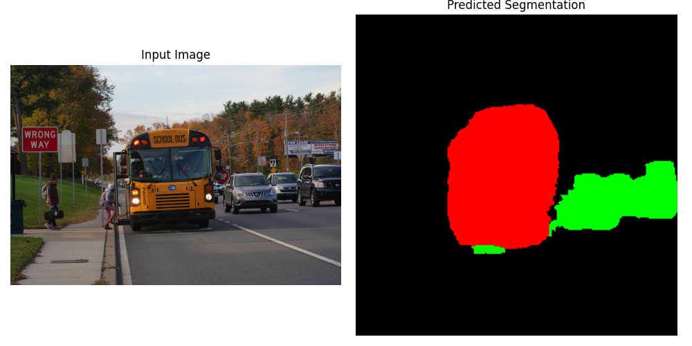
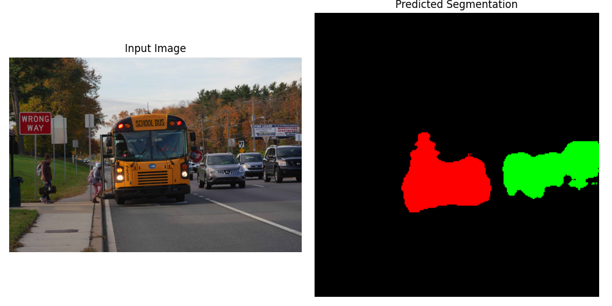

## Loss Function Comparison: Cross Entropy vs. Dice Loss

To evaluate the impact of different loss functions on semantic segmentation performance, we compared two approaches:

- **Cross Entropy Loss** (standard pixel-wise classification)
- **Dice Loss** (optimized for imbalanced segmentation)

---

## 📷 Visual Comparison – Cross Entropy Loss

Here is an example output from the segmentation model trained with **Cross Entropy Loss and Dice loss**, respectively:

### Per-Class Metrics

#### **Cross Entropy Loss**

| **Class**        | **Precision** | **Recall** | **F1-Score** | **Support** |
|------------------|---------------|------------|--------------|-------------|
| Background        | 0.97          | 0.90       | 0.93         | 5,146,089   |
| Car               | 0.70          | 0.88       | 0.78         | 1,250,747   |
| Bus               | 0.52          | 0.70       | 0.60         | 156,170     |
| Traffic Light     | 0.00          | 0.00       | 0.00         | 594         |

#### **Dice Loss**

| **Class**        | **Precision** | **Recall** | **F1-Score** | **Support** |
|------------------|---------------|------------|--------------|-------------|
| Background        | 0.93          | 0.94       | 0.94         | 5,146,089   |
| Car               | 0.76          | 0.74       | 0.75         | 1,250,747   |
| Bus               | 0.74          | 0.57       | 0.64         | 156,170     |
| Traffic Light     | 0.00          | 0.00       | 0.00         | 594         |

---

### Observations

- **Dice Loss** performed better for **Bus** and **Car** classes, especially in **precision**, suggesting improved handling of class imbalance.
- 🎯 **Cross Entropy** achieved **higher recall** for **Car**, but at the cost of lower precision.
- 🆘 **Traffic Light** segmentation failed under both losses due to extremely low support — indicating a strong need for data augmentation or resampling.
- 🧱 **Background** class maintained high performance across both losses, slightly favoring **Dice Loss** in F1-score.

---

### Conclusion

- **Dice Loss** is generally more robust in **imbalanced datasets**, offering improved precision and overall segmentation balance.
- **Cross Entropy** may still outperform on dominant classes (like Car) in recall but can be biased by class frequency.
